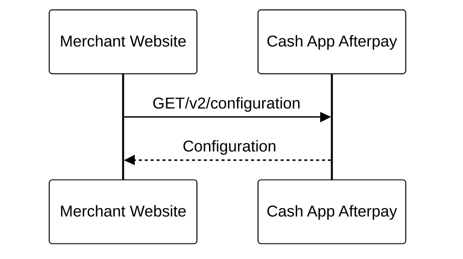
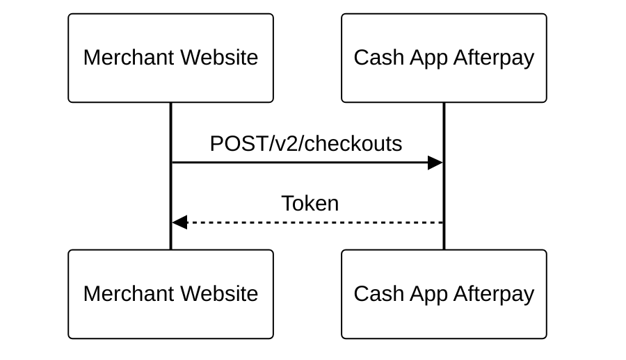

# Create a checkout

**What are the API calls required to create a new Cash App Afterpay order?**

---

| **Action**                | **Endpoint**                         | **Purpose**                                              |
|---------------------------|---------------------------------------|----------------------------------------------------------|
| [Get Configuration](https://developers.cash.app/docs/merchant/reference/configuration/operations/get-a-v-2-configuration)  | `/v2/platform/configuration`   | Retrieve Afterpay order limits (min/max values).         |
| [Create Checkout](https://developers.cash.app/docs/merchant/reference/checkouts/operations/create-a-v-2-checkout)    | `/v2/checkouts`    | Provide order details and generate a checkout token.           |

Before you create a Cash App Afterpay checkout you need to retrieve the minimum and maximum order amounts that Cash App Afterpay is enabled for. This is done through the Get Configuration endpoint.

## Get Configuration

[GET /v2/configuration](../../reference/Configuration.v2.yaml/paths/~1v2~1configuration/get)

Make this call as part of a scheduled background process. We recommend calling this endpoint once a day and storing the `minimumAmount` and `maximumAmount` server-side.

You, the merchant should use these values to determine:

1. The correct [Cash App Afterpay Messaging](../ONLINE-API/Afterpay-Messaging.md) to show on the Product Detail pages.

2. Whether your system presents Cash App Afterpay as an available payment method. A request to create a checkout is declined if the order grand total is less than the minimum or more than the maximum Cash App Afterpay amount. Check with your Cash App Afterpay contact to change your minimum or maximum range.

## Create Checkout

[POST /v2/checkouts](../../reference/Checkouts.v2.yaml/paths/~1v2~1checkouts/post)

Call the Create Checkout endpoint to give Cash App Afterpay information including:

* Customer Information

* Order Details

* Order Total

* Shipping Information

* The URL you would like to direct the customer to when they complete the Cash App Afterpay checkout flow

<!-- theme: info. -->
> **Note**
>
> Cash App Afterpay uses the Order Total value to calculate the installment plan and to assist with the customer’s pre-approval process.

After the call to the Create Checkout endpoint, Cash App Afterpay responds with a token used to identify this checkout.
For example, `002.5lmerr3k945d00c7htvcrdff83q36kp10a247m212fjpa5ju`

The token is used with the [Afterpay.js JavaScript library](../ONLINE-API/Standard-Checkout.md) to direct the customer to the Cash App Afterpay checkout flow.

**Cash App Afterpay Checkout Final Screen**

<!--
focus: false
-->

After the customer completes the checkout flow they are returned to the Merchant website URL provided in the Create Checkout request. If using the [redirect method](../ONLINE-API/Standard-Checkout.md) the URL has status appended to the Merchant URL. For Example:

* **If the customer successfully completes the checkout flow:** `www.merchant-example.com/confirm?&status=SUCCESS&orderToken=002.5lmerr3k945d00c7htvcrdff83q36kp10a247m212fjpa5ju`

* **If the customer closes the window:** `www.merchant-example.com/confirm?&status=CANCELLED&orderToken=002.5lmerr3k945d00c7htvcrdff83q36kp10a247m212fjpa5ju`

<!-- theme: info-->
> **Note**
>
> A [popup method](../ONLINE-API/Standard-Checkout.md#popup-method) is also available which uses a `postMessage` to communicate the status and token.

## Choose when to capture payment

Now that you have a successful pre-approval for the checkout you can either [capture the order directly](2a.-Direct-Capture.md) or create an [Auth API call](2b.-Auth-and-Capture.md) to place funds on hold until you are ready to capture.