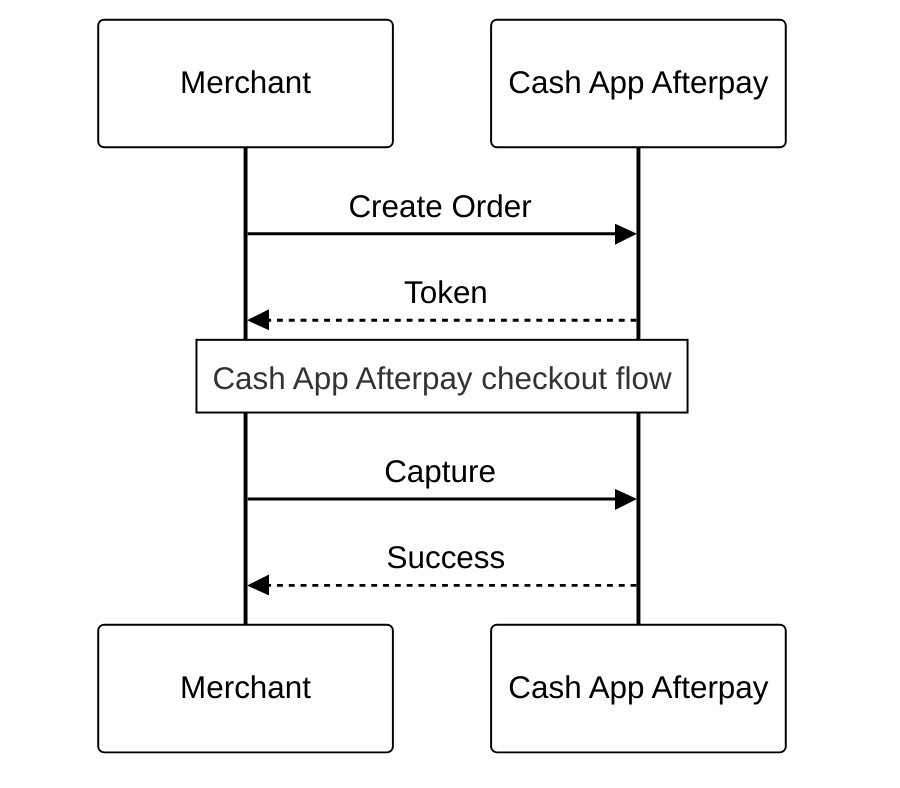

# Direct capture

**Funds are captured at the time of order**

---

Direct capture, or the *immediate payment flow*, combines the following actions into a single API call:
- Completing payment approval.
- Starting the customer’s payment plan.
- Settling the full order value into the merchant's bank account.

Direct capture provides a simplified and efficient payment process. It’s ideal for merchants who want to finalize and settle payments immediately upon order confirmation, or who want to minimize complexity.

## Implement direct capture

### API calls

| **Action**                | **Endpoint**                     | **Purpose**                                              |
|---------------------------|-----------------------------------|------------------------------------------------------------|
| [Capture Full Payment](https://developers.cash.app/docs/merchant/reference/payments/operations/create-a-v-2-payment-capture)       | `/v2/payments/capture`          | Capture order payment and confirm the order.             |
| [Update Shipping Courier](https://developers.cash.app/docs/merchant/reference/payments/operations/update-a-v-2-payment-courier)    | `/v2/payments/{orderId}/courier`           | Send shipment tracking details to Afterpay (optional). |

### Launch checkout and capture full payment

1. [Create a checkout](https://developers.cash.app/docs/merchant/api-development/api-calls-payment-flows/create-a-checkout). If the customer confirms their order with Afterpay, they’re returned to your website with an order token and the `SUCCESS` status.
2. Use the order token to call the [Capture Full Payment](https://developers.cash.app/docs/merchant/reference/payments/operations/create-a-v-2-payment-capture) endpoint. Once the capture completes, you'll receive a Payment object with a status of `APPROVED` or `DECLINED`. 
    - If Afterpay approves the payment, present the customer with an order confirmation page. The full payment is captured.
    - If Afterpay declines the payment (for example, if the customer’s credit card details are incorrect), present the customer with suggested corrections or alternative payment methods at checkout.

### Update shipping information

Optionally, you can provide tracking information to Cash App Afterpay by calling the [Update Shipping Courier](https://developers.cash.app/docs/merchant/reference/payments/operations/update-a-v-2-payment-courier) endpoint. If there are multiple shipments for the order, call the endpoint for each individual shipment.

### Considerations
- Direct capture is supported by all platforms.
- You must call the Capture Full Payment endpoint within 180 minutes of receiving the token from the Create Checkout call. 
- The Capture Full Payment call is idempotent. It’s safe to retry requests within 24 hours using the same unique requestId.
- Express checkout requires additional data. See [Express Checkout Integration](https://developers.cash.app/docs/merchant/express-checkout-existing-merchants/how-to-integrate/introduction) to learn more.
