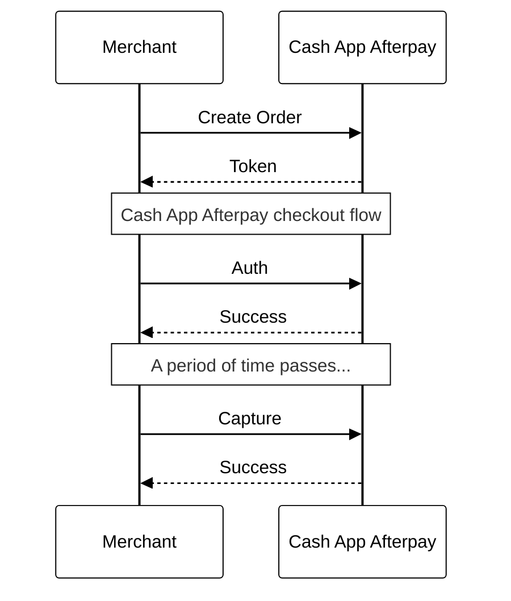

# Auth and capture

**Funds are authorized at order and captured at shipment**

---

Auth and capture, or the *deferred payment flow*, lets merchants authorize the full payment amount up-front and collect the funds later. The transaction is approved and the customer's payment plan is started. Then, you can capture full or partial payments. If a portion of the order can’t be fulfilled, you can void uncaptured amounts.

This flow is recommended for merchants who ship orders in multiple parts or who charge the full order amount upon delivery.

## Implement auth and capture

### API calls

| **Action**                | **Endpoint**                         | **Purpose**                                              |
|---------------------------|---------------------------------------|----------------------------------------------------------|
| [Authorize Payment](https://developers.cash.app/docs/merchant/reference/payments/operations/create-a-v-2-payment-auth)   | `/v2/payments/auth`    | Authorize a payment amount for an Afterpay order.        |
| [Capture Payment ](https://developers.cash.app/docs/merchant/reference/payments/operations/create-a-v-2-payment-capture-1) | `/v2/payments/{orderId}/capture`  | Capture full or partial order payments against a payment authorization. |
| [Void](https://developers.cash.app/docs/merchant/reference/payments/operations/create-a-v-2-payment-void)    | `/v2/payments/{orderId}/void`  | Void a full or partial order value and refund the customer. |
| [Update Shipping Courier](https://developers.cash.app/docs/merchant/reference/payments/operations/update-a-v-2-payment-courier)    | `/v2/payments/{orderId}/courier`    | Send shipment tracking details to Afterpay (optional). |

### Launch checkout and authorize payment

1. [Create a checkout](https://developers.cash.app/docs/merchant/api-development/api-calls-payment-flows/create-a-checkout). If the customer confirms their order with Afterpay, they’re returned to your website with an order token and the `SUCCESS` status.
2. Use the order token to call the [Authorize Payment](https://developers.cash.app/docs/merchant/reference/payments/operations/create-a-v-2-payment-auth) endpoint. Once the authorization completes, you'll receive a Payment object with a status of `APPROVED` or `DECLINED`. 
    - If Afterpay authorizes the payment, store the payment `id` and the `expires` value of the `AUTH_APPROVED` payment event. Present the customer with an order confirmation page.
    - If Afterpay declines the payment (for example, if the customer’s credit card details are incorrect), present the customer with suggested corrections or alternative payment methods at checkout.

### Capture payment
If an order is given `APPROVED` status during the authorization flow, you can now capture the payment. This happens after the customer has seen their order confirmation page and may have left your website.

<!-- theme: warning -->
> **Important:** You must capture payment for authorized orders within 13 days. After 13 days, the authorization expires and is automatically voided. At this point, you aren’t able to capture any order value (partial or full). You can’t reopen or update voided transactions; you must call the Checkouts endpoint to create a new order.

#### If you can completely fulfill the order:

Once you determine that the entire order will be fulfilled, call the [Capture Payment](https://developers.cash.app/docs/merchant/reference/payments/operations/create-a-v-2-payment-capture-1) endpoint with the entire amount. 

The capture amount will match both the `originalAmount` and `openToCaptureAmount` for the Payment object, as it was returned in the Auth response.

#### If you can partially fulfill the order:

Once you determine that only part of the order will be fulfilled (for example, if some items are permanently out of stock): 

1. Call the [Capture Payment](https://developers.cash.app/docs/merchant/reference/payments/operations/create-a-v-2-payment-capture-1) endpoint with the amount for all items that will be fulfilled.
2. Call the [Void](https://developers.cash.app/docs/merchant/reference/payments/operations/create-a-v-2-payment-void) endpoint to finalize the order. Refund the `openToCapture` amount to the customer; this will reduce the `openToCapture` amount to zero. 

#### If you fulfill the order incrementally:

1. Once a shipment is dispatched, call the [Capture Payment](https://developers.cash.app/docs/merchant/reference/payments/operations/create-a-v-2-payment-capture-1) endpoint with the amount of all items in the shipment.
2. If you determine that a shipment can’t be dispatched, call the [Void](https://developers.cash.app/docs/merchant/reference/payments/operations/create-a-v-2-payment-void) endpoint with the amount of all applicable items.

You can capture or void payments multiple times. Requests that exceed the `openToCapture` amount will fail. Once the `openToCapture` amount equals zero, any further Capture or Void requests will fail. 

#### If you can’t fulfill any part of the order:

Once you determine that you can’t fulfill any part of the order, call the [Void](https://developers.cash.app/docs/merchant/reference/payments/operations/create-a-v-2-payment-void) endpoint. This refunds the `openToCapture` amount to the customer, reduces the `openToCapture` amount to zero, and finalizes the order.

> **Note:** We don’t recommend waiting for the authorization to automatically expire. Even though an approved authorization will automatically be voided after 13 days, the customer begins their payment plan at the time of authorization approval. 

### Update shipping information
Optionally, you can provide tracking information to Cash App Afterpay by calling the [Update Shipping Courier](https://developers.cash.app/docs/merchant/reference/payments/operations/update-a-v-2-payment-courier) endpoint. If there are multipple shipments for the order, call the endpoint for each individual shipment.

### Considerations

- The deferred payment flow is supported on the Afterpay v2 API, Salesforce Commerce Cloud, and Adobe Commerce (Magento).
- The minimum capture amount is $1.00; capture requests below $1.00 are rejected.
- If an order still has a `paymentState` of `AUTH_APPROVED` or `PARTIALLY_CAPTURED` when the authorization expires, the remaining order amount will automatically be voided. 
- The Capture Payment call is idempotent. It’s safe to retry requests using the same unique requestId.

