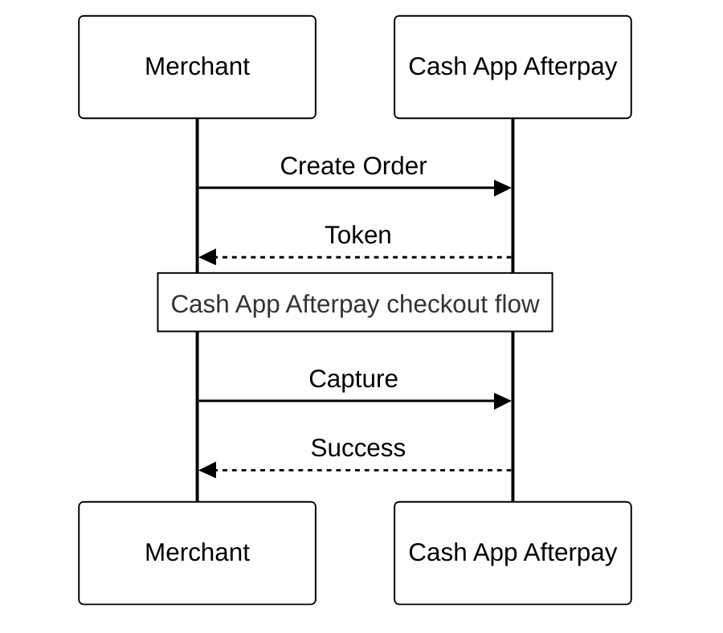
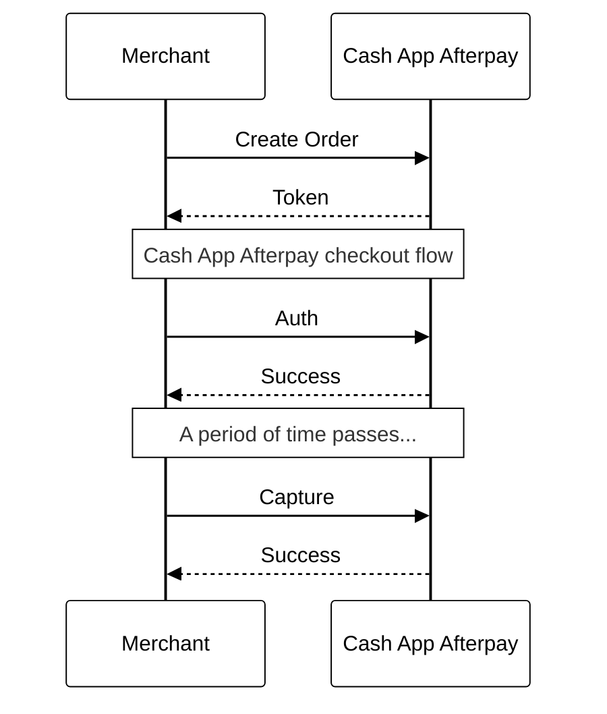

# API Calls and Payment Flows

The **Cash App Afterpay v2 API** offers merchants a choice of two different payment flows. The v1 API uses the Direct Capture flow.

<!--theme: info-->
> **Notes**
>
> Customer repayment starts once the order has been confirmed.
> * For Immediate Capture repayment starts on Capture.
> * For Deferred Payment repayment starts on Auth.

## 1. Direct Capture (Immediate Payment Flow)

This flow allows merchants to capture the full payment amount at the time of order.
Read more about this payment flow [here](https://developers.cash.app/docs/merchant/api-development/api-calls-payment-flows/direct-capture).

<!--theme: info-->
> **Notes**
>
> All platforms support the Direct Capture payment flow.

## 2. Auth and Capture (Deferred Payment Flow)

This flow allows merchants to capture incremental amounts as items are shipped. Cash App Afterpay settles funds when payments are captured by the merchant. If it is later determined that one or more shipments cannot be fulfilled, the un-captured remainder of the payment auth can be voided. This is similar to the Auth and Capture process of an order paid with a credit card.

Read about this payment flow [here](https://developers.cash.app/docs/merchant/api-development/api-calls-payment-flows/auth-capture).

