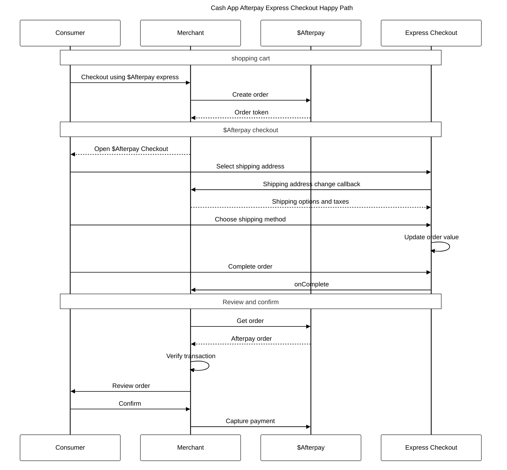

# Express checkout reference

## Sequence diagram

Express checkout has similar behaviour across both deferred and integrated shipping. The sequence diagram below shows a high-level checkout sequence for a customer using integrated shipping.



1. A customer (consumer) chooses _Checkout with Cash App Afterpay Express_ from the shopping cart or product.
2. The merchant calls the _Create Order_ or _Create Checkout_ endpoint, passing an option to enable dynamic pricing in the Express Checkout. 
3. The merchant uses the token in combination with the Javascript `afterpay.js` to direct the customer through the Cash App Afterpay Express checkout flow using the popup method. See the [Setup](Setup-ec.md) page.
4. The customer enters Express Checkout and selects the shipping address they want from their existing Cash App Afterpay details.
5. Cash App Afterpay calls the `onShippingAddressChange()` callback function on the merchant site to retrieve all shipping options and taxes for the chosen address.
6. The customer selects the shipping method and the order total, including the payment schedule, is updated to include the relevant shipping and taxes.
7. The customer confirms their Cash App Afterpay order and Cash App Afterpay notifies the merchant using the `onComplete()` callback function.
8. The merchant verifies the transaction by fetching the Order from Cash App Afterpay and comparing it to their own records.
9. The merchant shows the customer a confirmation page (optional).
10. The customer confirms their order. The merchant calls Cash App Afterpay to capture the payment, passing the calculated order amount for verification.

```json
AfterPay.initializeForPopup({
  countryCode: 'US',
  onCommenceCheckout: function(actions) {
    /* retrieve cash app afterpay token from your server */
    /* then call `actions.resolve(token)` */
  },
  onShippingAddressChange: function (data, actions) {
    /* required for Integrated Shipping  */
    /* address in `data` */
    /* calc options, then call `actions.resolve(options)` */
  },
  onShippingOptionChange: function (data) {
    /* optional - chosen option in `data` */
  },
  onComplete: function (data) {
    /* handle success/failure of checkout */
  },
  target: '#afterpay-express-button',
  buyNow: false,
  pickup: false,
  shippingOptionRequired: true
})
```
> **Note**
>
> Integrated Shipping is enabled by default for Express orders. To disable it, set `shippingOptionRequired` to false.


**Integrated and Deferred Shipping**

<!-- focus: false --> 


**Flow Diagram Key**

- Auth = Payment authorization
- Cart = Online shopping cart or basket
- Checkout = Checkout page
- Config = Configuration
- EC = Express Checkout
- PDP = Product Display Page

### Feature variant combinations

**InitializeForPopup only**

addressMode: `ADDRESS_WITH_SHIPPING_OPTIONS` - no widget needed.

This is the default configuration. 

Within the Cash App Afterpay Checkout flow, the customer can: 

* Select a shipping address from within their Cash App Afterpay account. 
* View shipping options from the merchant and select one. 
* Complete the order

The merchant must:

* Listen to the `onShippingAddressChange` and provide the relevant shipping options. 

**Recommended:** for orders that need to be shipped to the customer’s address and have up to five simple shipping options

***

addressMode: `PICKUP_FROM_ORDER_ADDRESS` - no widget needed.

Within the Cash App Afterpay Checkout flow, the customer can: 

* See their pickup address (previously selected on the merchant site), but not change it  
* View pickup options from the merchant and select one  
* Complete the order  
  
The merchant must:  

* Send pickup address when creating an order token  

* Listen to the `onShippingAddressChange` and provide the relevant pickup options  
  
**Recommended** for orders picked up at a specific location (e.g. your physical store)

***

addressMode: `SHIP_TO_ORDER_ADDRESS` - no widget needed.

Within the Cash App Afterpay Checkout flow, the customer can: 

* See their chosen order address from the merchant site (but not change it)  

* View shipping options from the merchant and select one  
Complete the order  
  
The merchant must: 

* Send shipping address when creating an order token  

* Listen to the `onShippingAddressChange` and provide the relevant shipping options  
  
**Recommended** for orders to be shipped to the customer’s address chosen on your site (before launching Express Checkout). In this case, the address displayed within the Cash App Afterpay checkout flow is locked and customers cannot change it.

***

**initializeForPopup or initializeForRedirect**

addressMode: `NO_ADDRESS` - no widget needed.

Within the Cash App Afterpay Checkout flow, the customer can:  
* Complete the order  
  
Customers cannot do the following actions within the Cash App Afterpay checkout flow  
* View a shipping or pickup address  
* View shipping options from the merchant and select one  
  
**Recommended** for when there is no shipping or pickup needed (eg.digital goods or services).

***

addressMode: `SHIP_TO_ORDER_ADDRESS_WITHOUT_SHIPPING_OPTIONS` - no widget needed.

Within the Cash App Afterpay Checkout flow, the customer can: 

- See their chosen order address from the merchant site (but not change it)  
- Complete the order  
  
Customer cannot do the following actions within the Cash App Afterpay checkout flow:  

- View shipping options from the merchant and select a shipping option  
  
The merchant must:  

- Send the shipping address when creating an order token  
  
**Recommended** for orders that must be shipped to the customer’s address chosen on your site (before launching Express Checkout), and there are no shipping options available for customers to choose from.

## Security - postMessage()

`afterpay.js` uses the HTML `postMessage()` API to exchange information between the Cash App Afterpay checkout popup and the page that spawned it. This allows Javascript code running on different origins to communicate with each other in a bidirectional manner.

The bidirectional communication allows a merchant to dynamically update shipping options and transaction information based on a chosen shipping address.

`afterpay.js` hides this complexity and restricts the use of `postMessage()` to ensure a secure environment. Specifically:

- Cash App Afterpay’s checkout window only receives messages from the merchant window, and vice versa

- Correctly handles multiple concurrent, and possibly out-of-order requests

- Message data is validated and sanitized

Using `postMessage()` in this way is considered very secure. For more information please refer to the [specification](https://developer.mozilla.org/en-US/docs/Web/API/Window/postMessage).