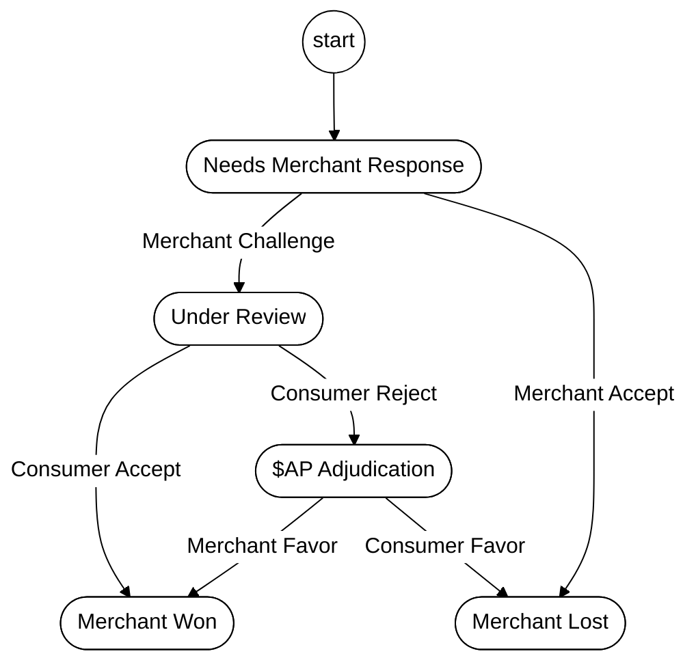
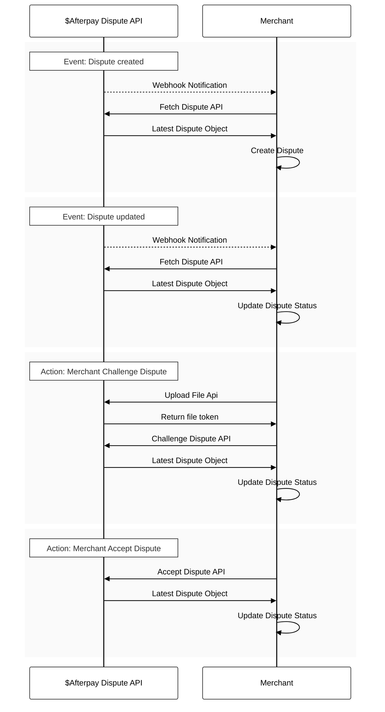

# Disputes Overview 

## End-to-end Dispute Flow

An overview of the end-to-end dispute flow is as follows:

1. Cash App Afterpay receives a dispute from the customer.
2. Cash App Afterpay notifies the merchant (programmatically) with a clear reason code for the dispute.
3. Merchant is notified that a dispute is opened using different methods that may include API, email, Business Hub, etc. 
4. Merchant accepts the dispute or submits evidence via API or Business Hub. 
5. Cash App Afterpay assesses the evidence and notifies the merchant via webhooks if the dispute is won or lost.
6. Cash App Afterpay notifies the customer that the dispute is resolved using the Consumer Portal, email etc.

### **Merchant Side Dispute Lifecycle Diagram**



### **Merchant Side Dispute API Integration Diagram**



## API Endpoints Overview

The following table lists the APIs provided to merchants.

<!--theme: info-->
> **Note**
>
> The Cash App Afterpay Dispute API uses [Basic HTTP Authentication](https://en.wikipedia.org/wiki/Basic_access_authentication), same as other Cash App Afterpay online API endpoints. Merchants can use the same credentials used for other endpoints.

| Endpoint                                  | Type | Description        |
|-------------------------------------------|------|---|
| [Get Dispute](Dispute-Open.md#get-dispute---endpoint)     | GET  | Enables merchants to fetch information on the status of a single dispute, based on a Dispute ID.  |
| [Accept Dispute](Dispute-Accept.md#accepting-a-dispute)    | POST | Enables merchants to accept a dispute. In these cases, the dispute status should display as **lost**.  |
| [Respond to Dispute](Dispute-Accept.md#respond-to-the-dispute) (e.g. submit evidence) | POST | Enables merchants to submit evidence or respond to a dispute.    |
| [List Disputes](Dispute-Open.md#retrieving-disputes)      | GET  | Merchants can get a list of disputes including Dispute ID and Last Modified Date. |
| [Upload File](Disputes-Retrieve.md#uploading-files)    | POST | Merchants can upload the files (evidence) used to respond to a dispute.    |
| [Retrieve File](Disputes-Retrieve.md#retrieving-files) | GET | Merchants can retrieve files using the File ID.  |

## Dispute Notifications

Cash App Afterpay notifies merchants using webhooks when a dispute is created and any time it is updated. Cash App Afterpay expects the ACK (acknowledgement) with a 200 response. If the acknowledgement fails, Cash App Afterpay will reattempt sending the webhook a few times with exponential backoff.

The following table outlines the content for the webhook call:

| Field name           | Data type | Description                     |
|----------------------|-----------|---------------------------------|
| `webhook_event_id`   | String    | The `event_id` of the webhook.  |
| `webhook_event_type` | String    | An enum variable that indicates if the dispute was created or updated. Possible values are `created` and `updated`              |
| `dispute_id`         | String    | Dispute Identifier.             |
| `merchant_reference` | String    | Merchant identifier.            |


A `dispute_id` is passed in the webhook call. Merchants can use the [Get Dispute](Dispute-Open.md#get-dispute---endpoint) endpoint to get the details for the dispute.

### Notification Setup

Merchants must provide a webhook URL and merchant IDs to the Cash App Afterpay merchant service/dispute team to get the HMAC key and enable the notification.

The webhook endpoint should be maintained by merchants or partners, it should allow POST requests with `content-type` = `application/json`. 

<!--theme: info-->
> **Note**
>
> The payload format is defined in the previous table.

### Notification Authentication

- (option 1) Key Exchange Wiki: [Diffie-Hellman Key Exchange via Openssl: Quick Guide](Disputes-Retrieve.md#key-exchange)
- (option 2) Securely get HMAC key from https://squareup.sendsafely.com/

### HMAC Signature

Cash App Afterpay recommends that you use HMAC for the authentication of the webhook notification. 
Consider the following structure of the raw HTTP message.

```javascript
POST ${notification_uri} HTTP/1.1
Host: ${notification_base_url}
X-Afterpay-Request-Date: 1664239810
X-Afterpay-Request-Signature: ${signature}
Content-Type: application/json
{
    "webhook_event_id": "b4df2187-4090-4845-be15-a73546107cbe",
    "webhook_event_type": "created",
    "dispute_id": "dp_KvGaECApCMdsH8earUSa2V",
    "merchant_reference": "08CF65ZSFNHVM"
}
```

There will be two extra fields for authentication. 

- `X-Afterpay-Request-Date` records the send time for the webhook request. We recommned aborting the stale notification after a fixed time (if you receive the webhook and current timestamp - `${X-Afterpay-Request-Date}` is greater than 5 minutes).
- `X-Afterpay-Request-Signature` records the signature of the HMAC key. Typically we generate the signature using the following steps:

    ```javascript
    PAYLOAD={"webhook_event_id": "b4df2187-4090-4845-be15-a73546107cbe", "webhook_event_type":       "created", "dispute_id": "dp_KvGaECApCMdsH8earUSa2V", "merchant_reference": "08CF65ZSFNHVM"}
    URL= "${partner_notification_uri}"
    SECRET=<hmac secret key here>
    TIME=1664239810
    MESSAGE="$URL\n$TIME\n$PAYLOAD"
    X-Afterpay-Request-Signature=$(printf "${MESSAGE}" | openssl dgst -hmac ${SECRET} -sha256   -binary | base64)
    ```

When a merchant or merchant agency receives a webhook notification, we recommend generating verification signatures in following steps. 
> If `HMAC == X-Afterpay-Request-Signature`, then continue to process the notification, or the merchant should abort the request.

```javascript
PAYLOAD={"webhook_event_id": "b4df2187-4090-4845-be15-a73546107cbe", "webhook_event_type": "created", "dispute_id": "dp_KvGaECApCMdsH8earUSa2V", "merchant_reference": "08CF65ZSFNHVM"}
URL= "${Notification_uri}"
SECRET=<hmac secret key here>
TIME=${X-Afterpay-Request-Date}
MESSAGE="$URL\n$TIME\n$PAYLOAD"
HMAC=$(printf "${MESSAGE}" | openssl dgst -hmac ${SECRET} -sha256 -binary | base64)
```

## Dispute Decisions and Closures

### Dispute Cancellation 

Canceled disputes (for example, disputes that may have been opened in error and must be retracted) can be closed with `customer_cancelled` as the `closing_reason`. 

<!--theme: info-->
> **Note**
>
> All dispute records are saved in the Cash App Afterpay System and are accessible through the Dispute APIs, we will not delete any dispute records.

### Settlement and Reporting

In financial reporting, there will be a separate record for a dispute. Order ID, Dispute ID, financial changes (+/-) are included in the record. 

<!--theme: info-->
> **Note**
>
> Cash App Afterpay only gathers funds from the merchant after the merchant loses the dispute.