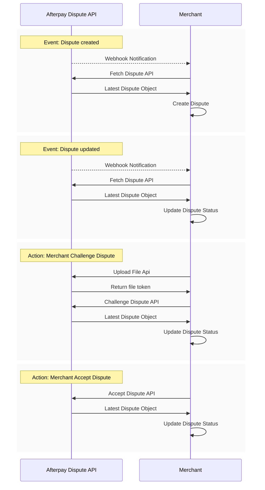

```mermaid
---
config:
  sequence:
    mirrorActors: true
    width: 300
---
sequenceDiagram
    participant AP as Afterpay Dispute API
    participant M as Merchant
    rect rgb(250,250,250)
      note over AP: Event: Dispute created
      AP -->> M: Webhook Notification
      M ->> AP: Fetch Dispute API
      AP ->> M: Latest Dispute Object
      M ->> M: Create Dispute
    end
    rect rgb(250,250,250)
      note over AP: Event: Dispute updated
      AP -->> M: Webhook Notification
      M ->> AP: Fetch Dispute API
      AP ->> M: Latest Dispute Object
      M ->> M: Update Dispute Status
    end
    rect rgb(250,250,250)
      note over AP: Action: Merchant Challenge Dispute
      M ->> AP: Upload File Api
      AP ->> M: Return file token
      M ->> AP: Challenge Dispute API
      AP ->> M: Latest Dispute Object
      M ->> M: Update Dispute Status
    end
    rect rgb(250,250,250)
      note over AP: Action: Merchant Accept Dispute
      M ->> AP: Accept Dispute API
      AP ->> M: Latest Dispute Object
      M ->> M: Update Dispute Status
    end
```