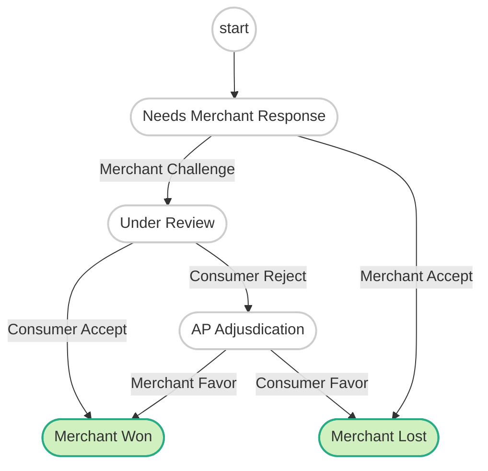

```mermaid
---
config:
  layout: dagre
---
flowchart TD
    id1(("start")) --> id2(["Needs Merchant Response"])
    id2 -- Merchant Challenge --> id3(["Under Review"])
    id2 -- Merchant Accept --> id6(["Merchant Lost"])
    id3 -- Consumer Accept --> id5(["Merchant Won"])
    id3 -- Consumer Reject --> id4(["AP Adjusdication"])
    id4 -- Merchant Favor --> id5
    id4 -- Consumer Favor --> id6
    id5:::termState
    id6:::termState
    classDef default fill:transparent,stroke:#ccc,stroke-width:2px
    classDef termState fill:#D0F0C0,stroke:#29AB87,stroke-width:2px
```