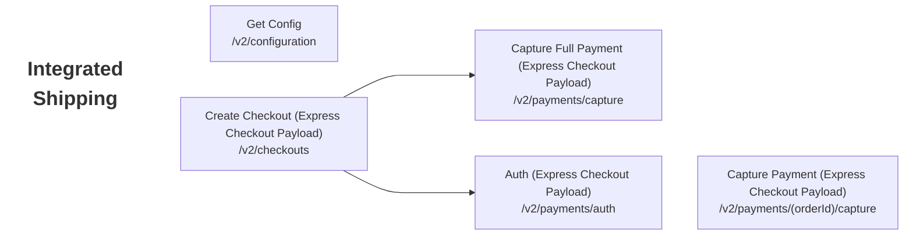

```mermaid
flowchart LR
    title["Integrated<br/>Shipping"]
    id1["Get Config<br/>/v2/configuration"]
    id2["Create Checkout (Express Checkout Payload)<br/>/v2/checkouts"]
    id3["Capture Full Payment (Express Checkout Payload)<br/>/v2/payments/capture"]
    id4["Auth (Express Checkout Payload)<br/>/v2/payments/auth"]
    id5["Capture Payment (Express Checkout Payload)<br/>/v2/payments/(orderId)/capture"]
    title ~~~ id1
    title ~~~ id2
    id2 ----> id3
    id2 ----> id4
    id4 ~~~ id5
    style title fill-opacity:0,stroke:transparent,font-size:1.2em,font-weight:bold;
```