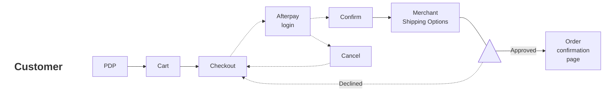

```mermaid
flowchart LR
    title["Customer"] ~~~ PDP
    PDP --> Cart
    Cart --> Checkout
    Checkout -.-> Login["Afterpay<br/>login"]
    Login -.-> Confirm
    Confirm --> Options["Merchant<br/>Shipping Options"]
    Options --- OrderApproval@{ shape: tri, label: "&nbsp;&nbsp;&nbsp;&nbsp;&nbsp;" }
    OrderApproval --> |Approved|OCP["`Order 
    confirmation 
    page`"]
    OrderApproval -.-> |Declined|Checkout
    Login -.-> Cancel
    Cancel -.-> Checkout
    style title fill-opacity:0,stroke:transparent,font-size:1.2em,font-weight:bold;
```