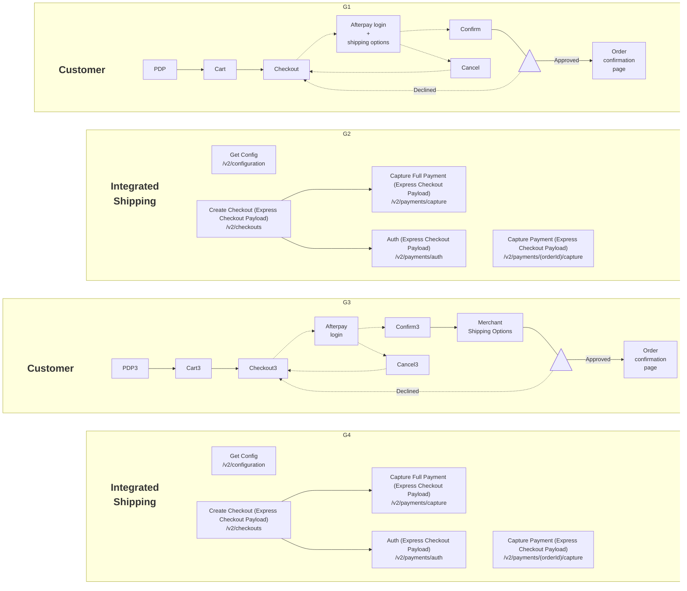

```mermaid
flowchart LR
    subgraph G4
        direction LR
        title4["Integrated<br/>Shipping"]
        id6["Get Config<br/>/v2/configuration"]
        id7["Create Checkout (Express Checkout Payload)<br/>/v2/checkouts"]
        id8["Capture Full Payment (Express Checkout Payload)<br/>/v2/payments/capture"]
        id9["Auth (Express Checkout Payload)<br/>/v2/payments/auth"]
        id10["Capture Payment (Express Checkout Payload)<br/>/v2/payments/(orderId)/capture"]
        title4 ~~~ id6
        title4 ~~~ id7
        id7 ----> id8
        id7 ----> id9
        id9 ~~~ id10
        style title4 fill-opacity:0,stroke:transparent,font-size:1.2em,font-weight:bold;
    end
    subgraph G3
        direction LR
        title3["Customer"] ~~~ PDP3
        PDP3 --> Cart3
        Cart3 --> Checkout3
        Checkout3 -.-> Login3["Afterpay<br/>login"]
        Login3 -.-> Confirm3
        Confirm3 --> Options3["Merchant<br/>Shipping Options"]
        Options3 --- OrderApproval3@{ shape: tri, label: "&nbsp;&nbsp;&nbsp;&nbsp;&nbsp;" }
        OrderApproval3 --> |Approved|OCP3["`Order 
        confirmation 
        page`"]
        OrderApproval3 -.-> |Declined|Checkout3
        Login3 -.-> Cancel3
        Cancel3 -.-> Checkout3
        style title3 fill-opacity:0,stroke:transparent,font-size:1.2em,font-weight:bold;
    end
    subgraph G2
        direction LR
        title2["Integrated<br/>Shipping"]
        id1["Get Config<br/>/v2/configuration"]
        id2["Create Checkout (Express Checkout Payload)<br/>/v2/checkouts"]
        id3["Capture Full Payment (Express Checkout Payload)<br/>/v2/payments/capture"]
        id4["Auth (Express Checkout Payload)<br/>/v2/payments/auth"]
        id5["Capture Payment (Express Checkout Payload)<br/>/v2/payments/(orderId)/capture"]
        title2 ~~~ id1
        title2 ~~~ id2
        id2 ----> id3
        id2 ----> id4
        id4 ~~~ id5
        style title2 fill-opacity:0,stroke:transparent,font-size:1.2em,font-weight:bold;
    end
    subgraph G1
        direction LR
        title1["Customer"] ~~~ PDP
        PDP --> Cart
        Cart --> Checkout
        Checkout -.-> Login["Afterpay login<br/>+<br/>shipping options"]
        Login -.-> Confirm
        Confirm --- OrderApproval@{ shape: tri, label: "&nbsp;&nbsp;&nbsp;&nbsp;&nbsp;" }
        OrderApproval --> |Approved|OCP["`Order 
        confirmation 
        page`"]
        OrderApproval -.-> |Declined|Checkout
        Login -.-> Cancel
        Cancel -.-> Checkout
        style title1 fill-opacity:0,stroke:transparent,font-size:1.2em,font-weight:bold;
    end
    style G1 width:100%;
    style G2 width:100%;
    style G3 width:100%;
    style G4 width:100%;
```