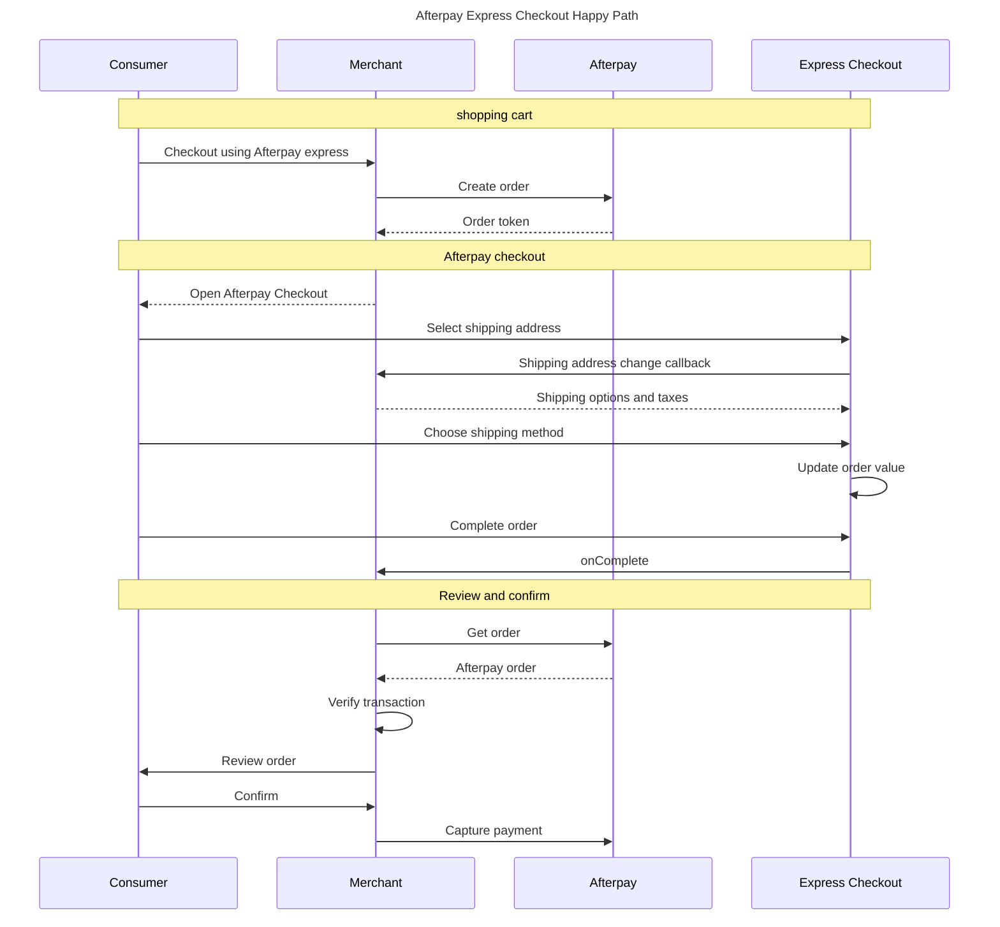

```mermaid
---
config:
  sequence:
    mirrorActors: true
    width: 250
---
sequenceDiagram
    title Afterpay Express Checkout Happy Path
    participant C as Consumer
    participant M as Merchant
    participant AP as Afterpay
    participant XCO as Express Checkout
    Note over C,XCO: shopping cart
    C->>M: Checkout using Afterpay express
    M->>AP: Create order
    AP-->>M: Order token
    Note over C,XCO: Afterpay checkout
    M-->>C: Open Afterpay Checkout
    C->>XCO: Select shipping address
    XCO->>M: Shipping address change callback
    M-->>XCO: Shipping options and taxes
    C->>XCO: Choose shipping method
    XCO->>XCO: Update order value
    C->>XCO: Complete order
    XCO->>M: onComplete
    Note over C,XCO: Review and confirm
    M->>AP: Get order
    AP-->>M: Afterpay order
    M->>M: Verify transaction
    M->>C: Review order
    C->>M: Confirm
    M->>AP: Capture payment
```